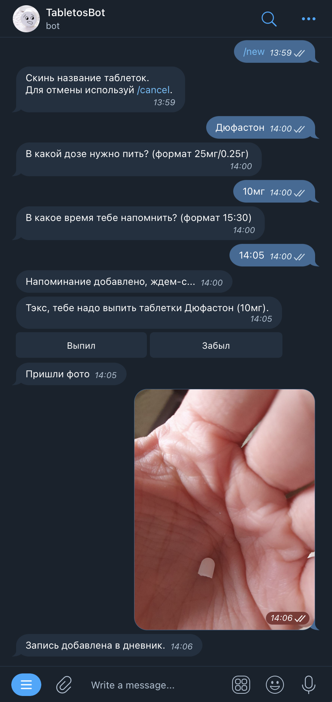

# TabletosBot
[](https://circleci.com/gh/elBroom/TabletosBot)

Телеграмм бот напоминающий пить таблеточки и журналирующий принятую дозировку.

Есть возможность откладывать напоминания автоматически, если проигнорировал сообщение или в ручную, настраивается отдельно.
Так же бот умеет записывать принятую дозировку после отправки фото, тоже настраивается отдельно.

Про анонимность можно не беспокоится, бот никакие персональные данные не хранит.

Ссылка на бот: https://t.me/TabletossBot



---
## Техническая информация
### Запуск:
```bash
docker-compose build
cp config.example.py config.py
vim config.py
# edit config.py
python3 init_db.py
docker-compose up -d
```

### Перезапуск:
```bash
make reinstall 
```

### Создание миграции:
```bash
make create_migrations 
```

### TODO:
- [x] Добавление напоминания
- [x] Отправка напоминаний по расписанию
- [x] Удаление напоминания
- [x] Удаление всех напоминаний
- [x] Сохранение состояния после перезагрузки (sqllite)
- [x] Остановка напоминания
- [x] Включение напоминания
- [x] Остановка всех напоминаний
- [x] Введение журнала принятых таблеток
- [x] Удаление записи из дневника
- [x] Автоматическое откладывание напоминания
- [x] Подтверждение принятой таблетки
- [x] Возможность отложить напоминание
- [x] Установка timezone
- [x] Настройка интервала напоминания
- [x] Настройка настойчивости бота
- [x] Подтверждение принятой таблетки с фото
- [x] Пропуск шага отправки фото
- [x] Написать help и настроить бот 
- [x] Отправка журнала в csv формате
- [x] Настроить CI
- [x] Получение timezone из локации
- [x] Логирование ошибок в sentry
- [x] Логирование действий
- [x] Редактирование настроек
- [x] Удаление персональных данных
- [x] Валидация пользовательских данных
- [x] Добавить возможность накатывать миграции схемы БД
- [x] Сохранять отложенные напоминания
- [x] Запись пропущенной дозы
- [x] Установка текущего времени для добавления дозы
- [ ] Установка напоминания на период дат
- [ ] Написать тесты
